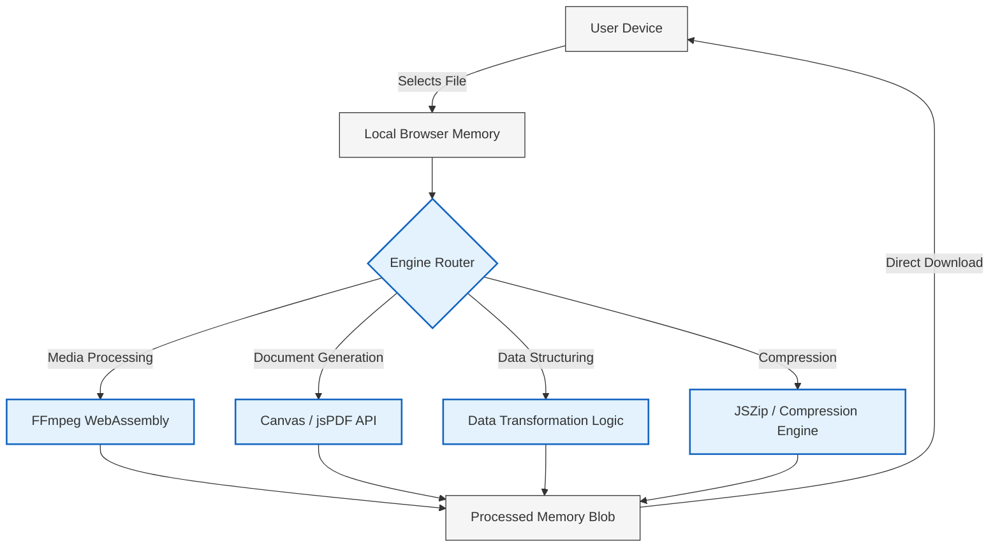

# Switchr

**Universal Client-Side File Conversion & Processing Platform**

Switchr is a high-performance, entirely browser-based file conversion suite. It leverages WebAssembly (WASM) to process media and documents locally on the client device, ensuring zero-latency execution, complete data privacy, and a seamless user experience.

---

## Architecture Overview

Switchr fundamentally shifts file processing from server-side infrastructure to the client edge. Files never leave the user's local network, eliminating bandwidth bottlenecks and security risks associated with third-party server uploads.



---

## Core Capabilities

*   **Absolute Privacy:** Files are never transmitted over the network. Processing occurs within the browser's sandboxed environment.
*   **WebAssembly Acceleration:** Integrates `@ffmpeg/core` via WASM to deliver native-grade media encoding capabilities within the browser.
*   **Dynamic CDN Fallback:** Intelligently manages large binary payloads (like the 32MB FFmpeg WASM core) by attempting local resolution before seamlessly falling back to an edge-delivered CDN. This ensures repository sizes remain minimal while maintaining high availability.
*   **Monorepo Architecture:** Built on Turborepo to enforce strict module boundaries and optimize build cache utilization.

---

## Supported Format Matrix

Switchr currently supports over 60 different file extensions across various domains. 

| Domain | Supported Input Formats | Primary Output Capabilities |
| :--- | :--- | :--- |
| **Media (Video)** | `MP4`, `WEBM`, `MKV`, `AVI`, `MOV`, `FLV`, `WMV` | Transcoding, Compression, Resolution Scaling |
| **Media (Audio)** | `MP3`, `WAV`, `AAC`, `OGG`, `FLAC`, `M4A`, `OPUS` | Format Shifting, Bitrate Adjustment |
| **Media (Image)** | `JPG`, `PNG`, `WEBP`, `SVG`, `BMP`, `GIF`, `TIFF` | Compression, Format Conversion, Resizing |
| **Documents** | `PDF`, `DOCX`, `TXT`, `MD`, `HTML`, `RTF` | Client-Side PDF Generation, Text Extraction |
| **Structured Data**| `JSON`, `CSV`, `XML`, `YAML`, `TSV` | Cross-Format Parsing and Serialization |
| **Archives** | `ZIP`, `TAR`, `GZ` | Client-side packing and extraction |

---

## Technical Specifications

| Component | Technology | Description |
| :--- | :--- | :--- |
| **Framework** | Next.js 16 | App Router, React Server Components |
| **Build System** | Turborepo | Task orchestration and remote caching |
| **Language** | TypeScript | Strict type-checking and interface definitions |
| **Styling** | Tailwind CSS v4 | Utility-first CSS framework |
| **Animation** | Framer Motion | Hardware-accelerated transitions |
| **State Management**| Zustand | Unidirectional state flow for conversion queues |
| **Media Engine** | FFmpeg.wasm | WebAssembly port of the FFmpeg multimedia framework |

---

## Development Environment Setup

### Prerequisites

Ensure the following runtimes are installed in your environment:
*   Node.js (v20.x or higher recommended)
*   npm (v10.x or higher)

### Initialization

1.  **Clone the repository:**
    ```bash
    git clone https://github.com/your-organization/Switchr.git
    cd Switchr
    ```

2.  **Resolve dependencies:**
    ```bash
    npm install
    ```

3.  **Execute the development server:**
    ```bash
    npm run dev
    ```
    The application will be accessible at `http://localhost:3000`.

---

## Deployment Configuration (Vercel)

The application is highly optimized for deployment on Vercel. 

### Cross-Origin Isolation Requirements

Due to the utilization of `SharedArrayBuffer` for multi-threaded FFmpeg execution, the application requires strict Cross-Origin Isolation headers. These are pre-configured in `apps/web/next.config.ts`:

```typescript
// Required for WebAssembly SharedArrayBuffer
headers: [
  { key: "Cross-Origin-Embedder-Policy", value: "require-corp" },
  { key: "Cross-Origin-Opener-Policy", value: "same-origin" },
]
```

### Vercel Integration Steps

1.  Import the repository into the Vercel Dashboard.
2.  In the Project Configuration panel, locate the **Root Directory** setting.
3.  Set the **Root Directory** to `apps/web`.
4.  Vercel will automatically detect the Turborepo configuration and Next.js framework.
5.  Initiate the deployment. 

---

## License

Copyright (c) 2026 Switchr Contributors.

Licensed under the MIT License. See the `LICENSE` file for full documentation.
