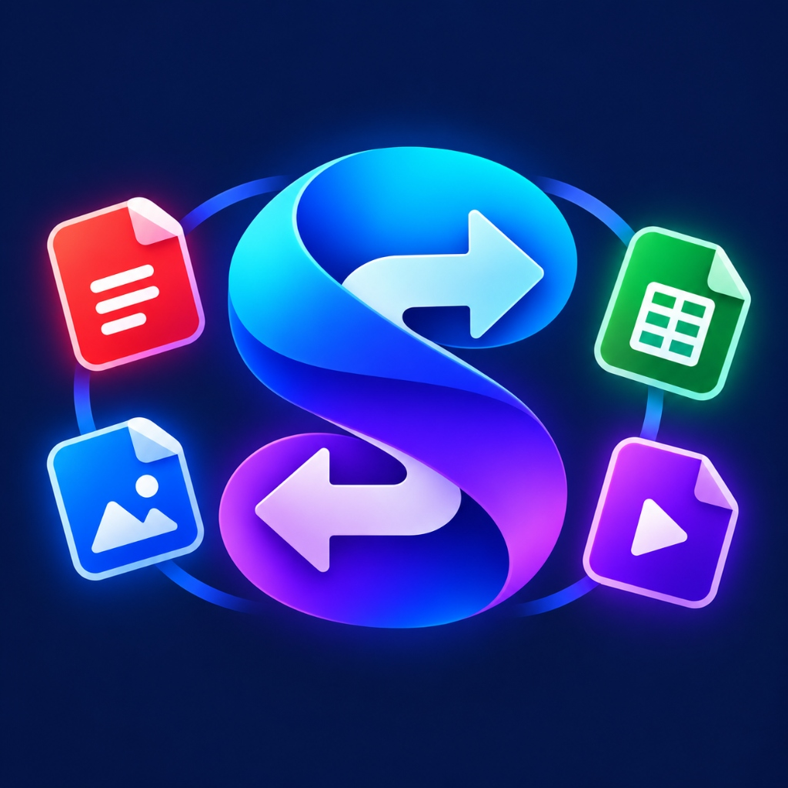

# Switchr ⚡ — Universal Client-Side File Converter

<p align="center">
  
</p>

<p align="center">
  <b>Fast, Private, In-Browser File Conversion & Compression Tool suite</b><br />
  Convert Images, Audio, Video, Documents, and Data files entirely on your device with WebAssembly.
</p>

<p align="center">
  <a href="#features">Features</a> •
  <a href="#supported-formats">Supported Formats</a> •
  <a href="#tech-stack">Tech Stack</a> •
  <a href="#getting-started">Getting Started</a> •
  <a href="#deployment">Deployment</a> •
  <a href="#privacy">Privacy</a>
</p>

---

## ✨ Features

- 🔒 **100% Private & Local**: Files are processed directly in your browser using WebAssembly (FFmpeg WASM, Canvas API, jsPDF, JSZip). Your files are never uploaded to any external server.
- ⚡ **Lightning Fast**: Powered by Turbopack, Next.js 16, and Web Workers for zero-latency conversion.
- 🎨 **Modern Sleek UI**: Built with Tailwind CSS v4, Framer Motion animations, dark/light theme toggling, and clean responsive design.
- 📁 **Batch Conversion & ZIP Download**: Convert multiple files in parallel and download them individually or bundled into a single ZIP archive.
- 🗜️ **Smart Compression**: Compress images and documents with granular quality controls and real-time size reduction metrics.
- 📱 **Mobile & Desktop Responsive**: Seamless experience across smartphones, tablets, and wide monitors.

---

## 📂 Supported Formats

Switchr supports **60+ file formats** across multiple categories:

| Category | Formats |
|---|---|
| **Images** | JPG, PNG, WEBP, SVG, BMP, GIF, ICO, TIFF, AVIF |
| **Documents** | PDF, DOCX, TXT, MD, HTML, RTF |
| **Audio** | MP3, WAV, AAC, OGG, FLAC, M4A, OPUS, WMA |
| **Video** | MP4, WEBM, MKV, AVI, MOV, FLV, WMV |
| **Data & Code** | JSON, CSV, XML, YAML, TSV |
| **Archives** | ZIP, TAR, GZ |

---

## 🛠️ Tech Stack

- **Framework**: [Next.js 16](https://nextjs.org/) (App Router, Turbopack)
- **Monorepo**: [Turborepo](https://turbo.build/)
- **UI & Styling**: [Tailwind CSS v4](https://tailwindcss.com/), [Framer Motion](https://www.framer.com/motion/), [Lucide React](https://lucide.dev/)
- **Engine / Core**:
  - `@ffmpeg/ffmpeg` & `@ffmpeg/core` (Client-side audio/video encoding via WebAssembly)
  - `jspdf` (Client-side PDF generation)
  - `jszip` (Client-side ZIP packing and extraction)
- **State Management**: [Zustand](https://github.com/pmndrs/zustand)
- **Notifications**: [Sonner](https://sonner.emilkowal.ski/)
- **Language**: [TypeScript](https://www.typescriptlang.org/)

---

## 🚀 Getting Started

### Prerequisites

- **Node.js**: `v20.x` or higher
- **npm**: `v10.x` or higher (or pnpm / yarn)

### Installation

1. **Clone the repository**:
   ```bash
   git clone https://github.com/YOUR_USERNAME/Switchr.git
   cd Switchr
   ```

2. **Install dependencies**:
   ```bash
   npm install
   ```

3. **Start the development server**:
   ```bash
   npm run dev
   ```

4. **Open in browser**:
   Navigate to [http://localhost:3000](http://localhost:3000).

---

## 🏗️ Production Build

To test and compile the production build:

```bash
npm run build
```

To start the production server locally:

```bash
npm --workspace=web run start
```

---

## 🌐 Deployment

### Deploy to Vercel (Recommended)

Switchr is optimized for one-click deployment on [Vercel](https://vercel.com/):

1. Push your repository to **GitHub**.
2. Go to [Vercel](https://vercel.com/new) and click **Import Project**.
3. Select your `Switchr` repository.
4. Set the **Root Directory** to:
   ```text
   apps/web
   ```
5. Click **Deploy**.

> **Note on WebAssembly & Headers**:
> `apps/web/next.config.ts` includes the required `Cross-Origin-Embedder-Policy: require-corp` and `Cross-Origin-Opener-Policy: same-origin` headers. These headers enable `SharedArrayBuffer` support in modern browsers, ensuring FFmpeg WebAssembly runs properly in production.

---

## 🛡️ Privacy & Security

Switchr was designed with security and confidentiality first:
- **No file upload**: Your files stay inside your device's memory.
- **No tracking of file contents**: All encoding and compression occurs client-side.
- **No account required**: Zero barriers, zero data collection.

---

## 📄 License

This project is licensed under the [MIT License](LICENSE).
